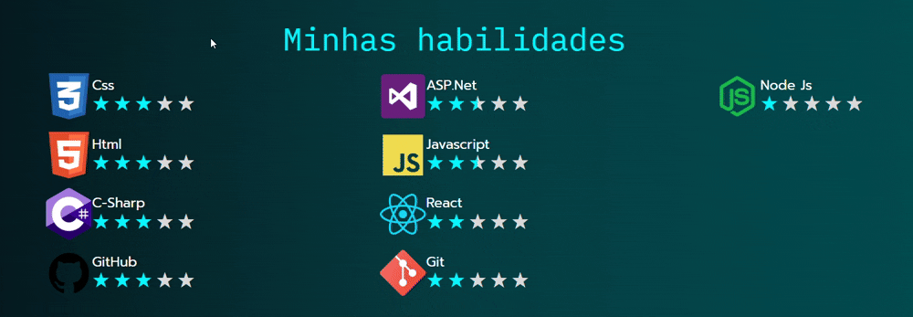

<h1> Portfólio Giovanni A. Valieri</h1>

<h2>Resumo</h2>

Este projeto consiste no meu portfólio desenvolvido com HTML, CSS, Javascript e React

O portfólio foi produzido pensando na atualização dinâmica de seu conteúdo através de uma futura base de dados que irei implementar

<h2> Objetivo</h2>

O objetivo é mostrar quem eu sou, o que já fiz e o que sou capaz de fazer através de um site para as pessoas me conhecerem.

Além disso, também foi uma forma de colocar em prática o que já conheço em desenvolvimento de sistemas front-end e, futuramente, back-end

<h2> Tecnologias utilizadas</h2>
<ul>
    <li>
 <b>HTML</b>: utilizado para criar a página e definir a raiz dessa página
</li>
    <l1>
 <b>CSS</b>: utilizado para estilizar o site e implementar responsividade de acordo com o tamanho do aparelho do usuário
</li>
    <li>
 <b>Javascript</b>: utilizado para implementar vetores de objetos a serem renderizados na página, permitir estruturar o código para futura implementação de um banco de dados real. Também foi utilizado para criar funções que respondem a eventos do usuário.
</li>
    <li>
 <b>React</b>: biblioteac utilizada para criar componentes a serem renderizados na página, estados (states) para interações dinâmicas com o usuário e propriedades (props) para a reutilização de componentes.
</li>
</ul>

<h2> Como funciona</h2>
<h3>Estrutura do código</h3>

Cada pasta foi criada para organizar cada arquivo utilizado no projeto.

Dentro da pasta <b>src</b> estão todos os arquivos utilizados para a construção do site

Em <b>assets</b>, separei duas pastas para a estilização do site:
<ul>
    <li>
<b>css</b>: para armazenar os arquivos de folha de estilos css. Cada arquivo css possui um nome que referencia o nome do componente que utiliza esta folha de estilos.
</li>
    <li>
<b>images</b>: para armazenar as imagens e gifs utilizados no projeto. Separei em três diferentes pastas para identificar a função de cada imagem.

        <ul>
            <li>
<b>design</b>: armazena as imagens utilizadas com o único próposito de estilizar o site
</li>
            <li>
<b>projetos</b>: armazena gifs de alguns projetos que desenvolvi que estão na seção "Meus projetos - destaques" do portfólio
</li>
            <li>
<b>trajetoria</b>: armazena imagens que representam a minha trajetória destacada na seção "Linha do Tempo" do portfólio
</li>
        </ul>
    </li>
</ul>

Dentro da pasta <b>componentes</b> estão todos os componentes React que desenvolvi para renderizar cada conteúdo do portfólio

Além disso, separei a pasta <b>subcomponentes</b> para organizar os componentes que são utilizados dentro de outros componentes

Outro ponto a destacar é que o componente <b>Portfólio</b> tem a função de renderizar todos os componentes que formam a página. Dessa forma, o componente <b>main</b>, que se encontra fora da pasta componentes, renderiza este componente

Os arquivos js, como o <b>dadosProjetos</b>, possuem a função de simular um banco de dados. Fiz isso para estruturar os componetes de forma que eles renderizem conteúdos de acordo com os dados armezandos nesses arquivos.

<h3> Funcionaliades</h3>

Utilizando propriedades nos subcomponentes, principalmente em <b>Display</b>, estes componentes podem ser reutilizados, caso necessário, em futuras atualizações do portfólio.

Os componentes <b>SobreMim</b>, <b>Projetos</b> e <b>Habilidades</b> renderizam elementos com base nos objetos armazenados nos arquivos js, simulando uma conexão com um banco de dados para atualizações dinâmicas na página. Ou seja, dessa forma, não precisarei atualizar o código em si para atualizar alguma informação depois que este projeto se conectar a uma base de dados real.

<h4> Eventos</h4>

Utilizando estados (state), consigo criar eventos que respondem às ações do usuário.

O componente <b>Display</b>, que possui a função de mostrar uma descrição sobre determinado item, só é renderizado quando o ponteiro do mouse entra na área de alguns itens, como na Linha do Tempo, mostrando uma descrição sobre este item. Além disso, o Display atualiza sua posição de acordo com aposição do mouse, ou seja, ele segue o cursor

<h5>Display na Linha do Tempo</h5>

<h5>Display em Habilidades</h5>

<h2> Atualizações futuras</h2>

Bem, como já deu para perceber durante a leitura deste arquivo, pretendo fazer muitas atualizações para meu portfólio

A principal atualização que quero fazer é conectar a um banco de dados real para atualizar o site de forma dinâmica

Outra implementação que quero realizar é atualizar os projetos que aparecem na seção "Meus projetos - destaques" semanalmente de forma dinâmica e automática. Dessa forma, consigo mostrar meus outros projetos que realizei e que vou fazer futuramente
